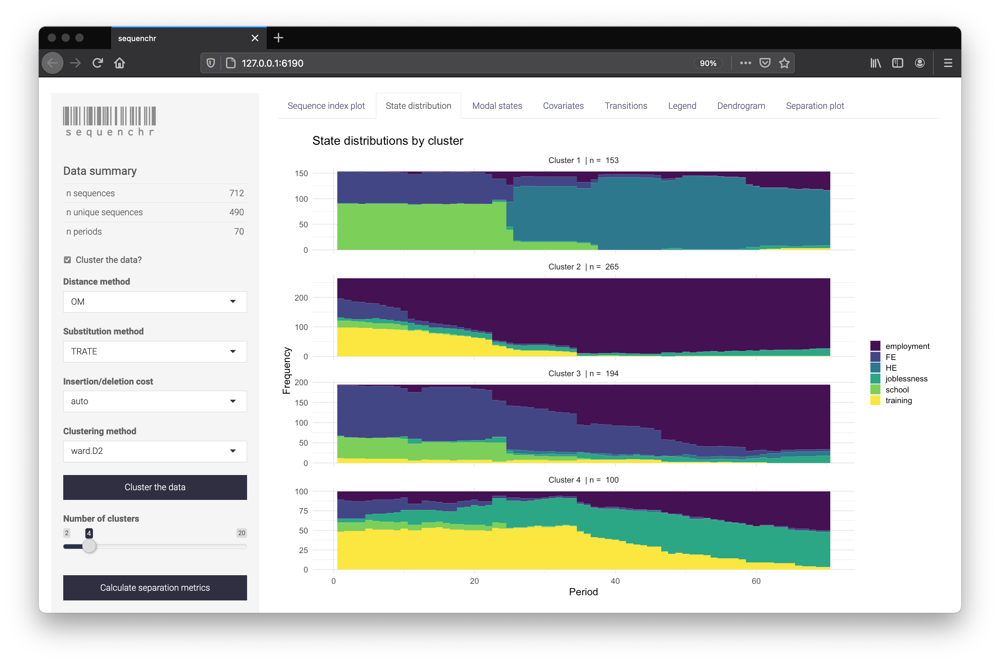

<!-- README.md is generated from README.Rmd. Please edit that file -->

```{r, include = FALSE}
knitr::opts_chunk$set(
  collapse = TRUE,
  comment = "#>",
  fig.path = "man/figures/README-",
  out.width = "100%"
)
```

# sequenchr

<!-- badges: start -->
<!-- badges: end -->

Sequence analysis tool for applied researchers. Designed for faster analysis iterations or for whom just prefer an interactive interface. Supplements the powerful [TraMineR](http://traminer.unige.ch/) package.

<p align="center">

</p>

## Installation

You can install the latest version of sequenchr via:

``` r
# install.packages("devtools")
devtools::install_github("joemarlo/sequenchr", build_vignettes = TRUE)
```

## Example

```{r example, eval=FALSE}
library(TraMineR)
library(sequenchr)

# load data and convert to a sequence object
data(mvad)
seqstatl(mvad[, 17:86])
mvad.alphabet <- c("employment", "FE", "HE", "joblessness", "school",
                   "training")
mvad.labels <- c("employment", "further education", "higher education",
                 "joblessness", "school", "training")
mvad.scodes <- c("EM", "FE", "HE", "JL", "SC", "TR")
mvad.seq <- seqdef(mvad, 17:86, alphabet = mvad.alphabet, states = mvad.scodes,
                   labels = mvad.labels, xtstep = 6)

# launch the sequenchr app
launch_sequenchr(mvad.seq)


### Or use the plotting functions directly ....

# tidy the data
seq_def_tidy <- tidy_sequence_data(mvad.seq)

# plot the sequence index
plot_sequence_index(seq_def_tidy)

# cluster the data
dist_matrix <- TraMineR::seqdist(seqdata = mvad.seq, method = "DHD")
cluster_model <- hclust(d = as.dist(dist_matrix), method = 'ward.D2')
cluster_labels <- label_clusters(cluster_model, k = 5)

# plot the sequence index by cluster
plot_sequence_index(seq_def_tidy, cluster_labels = cluster_labels)

# customize your plots via standard ggplot functions
library(ggplot2)
theme_set(theme_minimal())
plot_sequence_index(seq_def_tidy, cluster_labels = cluster_labels) +
  scale_x_continuous(breaks = seq(0, 70, by = 5)) +
  labs(title = 'My seqI plot',
       subtitle = 'A helpful subtitle',
       x = 'Month',
       fill = 'States',
       caption = 'Data from McVicar and Anyadike-Danes') +
  theme(legend.position = 'bottom')
```

See the vignette for more information:

```{r vignette, eval=FALSE}
vignette('sequenchr')
```

## Development to-do
- Review function examples, argument description, and function description
- Replace `fpc` with custom function?
- Improve the covariates plotting
- Add loading modals
