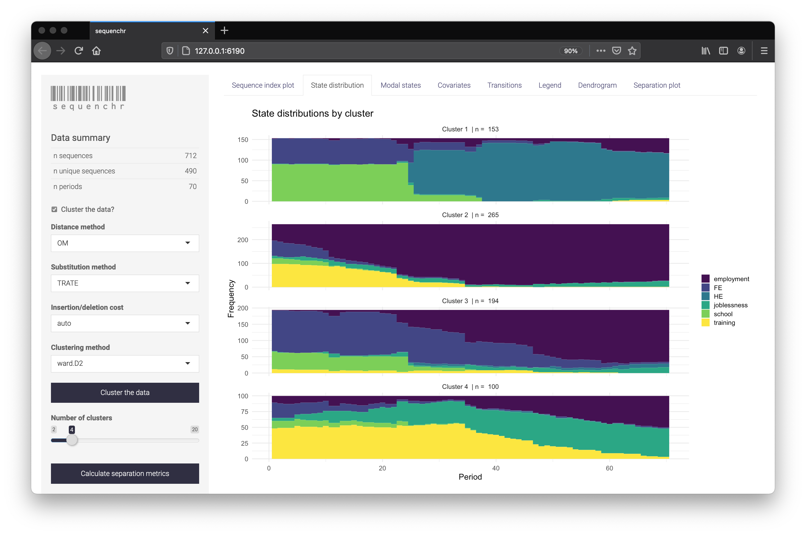

```{r, include = FALSE}
knitr::opts_chunk$set(
  collapse = TRUE,
  comment = "#>"
)
```

This vignette walks through the basic usage of sequenchr and helpful tips when using the functions directly.

Sequenchr is a sequence analysis tool for applied researchers. It is designed to enable faster analysis iterations and is also great for those who prefer an interactive interface. The core of the package is the interactive Shiny app but the majority of the underlying functions can be accessed directly through R.

## Launching the sequenchr Shiny app

Sequenchr is built on top of the powerful sequench analysis package TraMineR which provides a number of helpful functions to manipulate and analyze sequence data.

The sequenchr Shiny app requires a TraMineR object created from `TraMineR::seqdef`. For more information on using TraMineR, see [http://traminer.unige.ch/](http://traminer.unige.ch/). Once the TraMineR object is created, calling `sequenchr::launch_sequechnr` will launch the Shiny app in a new browser window.

```{r app usage}
library(TraMineR)
library(sequenchr)

# load data and convert to a sequence object
data(mvad)
seqstatl(mvad[, 17:86])
mvad.alphabet <- c("employment", "FE", "HE", "joblessness", "school",
                   "training")
mvad.labels <- c("employment", "further education", "higher education",
                 "joblessness", "school", "training")
mvad.scodes <- c("EM", "FE", "HE", "JL", "SC", "TR")
mvad.seq <- seqdef(mvad, 17:86, alphabet = mvad.alphabet, states = mvad.scodes,
                   labels = mvad.labels, xtstep = 6)
```
```{r launch_sequenchr, eval=FALSE, include=TRUE}
# launch the sequenchr app
launch_sequenchr(sequence_data = mvad.seq)
```

<p align="left">

</p>

The sequenchr app displays plotting of the state sequences and hierarchical clustering. Distance methods, clustering methods, and seperation metrics can be specified on the left side. Cluster labels can also be downloaded as a .csv if you wish to use them directly within R.

Passing a dataframe to the optional argument `covariates_data` within `sequenchr::launch_sequenchr` will visualize the covariates and split them based on cluster membership. The covariates data is matched to the `sequence_data` via row position so both contain the same number of rows.

```{r covariates, eval=FALSE, include=TRUE}
covariates_data <- data.frame(x1 = rnorm(nrow(mvad.seq)), 
                              x2 = rnorm(nrow(mvad.seq)))
launch_sequenchr(mvad.seq, covariates_data)
```


## Using the sequenchr functions directly

The functions that power the sequenchr app can also be used directly. All plotting functions start with sequenchr::plot_* and most require a tidy dataframe created from the TraMineR object. 

The tidy dataframe is created via `sequenchr::tidy_sequench_data` and then is passed to the `sequenchr::plot_* functions`.

```{r function usage, fig.height=4, fig.width=6}
# tidy the data
seq_def_tidy <- tidy_sequence_data(mvad.seq)

# plot the sequence index
plot_sequence_index(seq_def_tidy)
```

### Modifying plots

Plots are standard ggplot2 objects and can be customized using ggplot2 syntax. For example, the theme, scales, and labels can be modified by calling their respective functions on `sequenchr::plot_*` output, concatenated with `+`.

```{r ggplot usage, fig.height=4, fig.width=6}
library(ggplot2)
theme_set(theme_minimal())
p <- plot_sequence_index(seq_def_tidy)

p +
  scale_x_continuous(breaks = seq(0, 70, by = 5)) +
  labs(title = 'My seqI plot',
       subtitle = 'A helpful subtitle',
       x = 'Month',
       fill = 'States',
       caption = 'Data from McVicar and Anyadike-Danes') +
  theme(legend.position = 'bottom')
```

### Managing identical legends across plots

Sequence analysis results are often presented in intricate plots requiring, at times, significant cognitive burden on inexperienced readers. Maintaining identical color schemes across your various plots can help reduce the burden. Each of the `sequenchr::plot_*` functions includes a `color_mapping` argument that specifies each state's color ensuring identical legends across yours plots.

The `viridis` color palette (accessed through the package of the same name) is recommended for its advantages for colorblind readers and greyscale printing. See more [here](https://cran.r-project.org/web/packages/viridis/vignettes/intro-to-viridis.html).

```{r color_mapping, fig.height=4, fig.width=6}
# establish color mapping 
alphbt <- TraMineR::alphabet(mvad.seq)
color_mapping <- viridis::viridis_pal()(length(alphbt))
names(color_mapping) <- alphbt

# plot it
plot_sequence_index(seq_def_tidy, color_mapping = color_mapping)
plot_modal(seq_def_tidy, color_mapping = color_mapping)
```
```{r legend, fig.height=3, fig.width=1.5}
# plot just the legend
plot_legend(color_mapping)
```

### Managing cluster labels between dendrogram and plot_* functions

Often the clusters produced by dendrograms have different labels than those produced by `stats::cutree` resulting in different cluster labels for `sequenchr::plot_dendrogram` and other `sequenchr::plot_*` functions. This is mitigated by using `sequenchr::label_clusters` to cut the tree into k clusters. The resulting numbered labels match the dendrogram labels left-to-right.

```{r dendrogram, fig.height=3, fig.width=6}
# cluster the data
dist_matrix <- TraMineR::seqdist(seqdata = mvad.seq, method = "DHD")
cluster_model <- fastcluster::hclust(d = as.dist(dist_matrix), method = 'ward.D2')

# plot the dendrogram
plot_dendrogram(cluster_model, k = 5)
# get the cluster labels
cluster_labels <- label_clusters(cluster_model, k = 5)
```
```{r clusters, fig.height=8, fig.width=6}
# pass those labels to plot_* functions
plot_sequence_index(seq_def_tidy,
                    color_mapping = color_mapping,
                    cluster_labels = cluster_labels)
```

